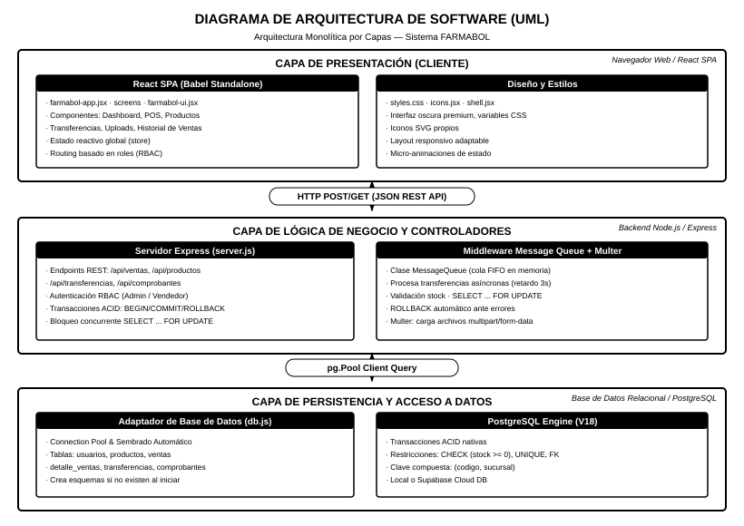
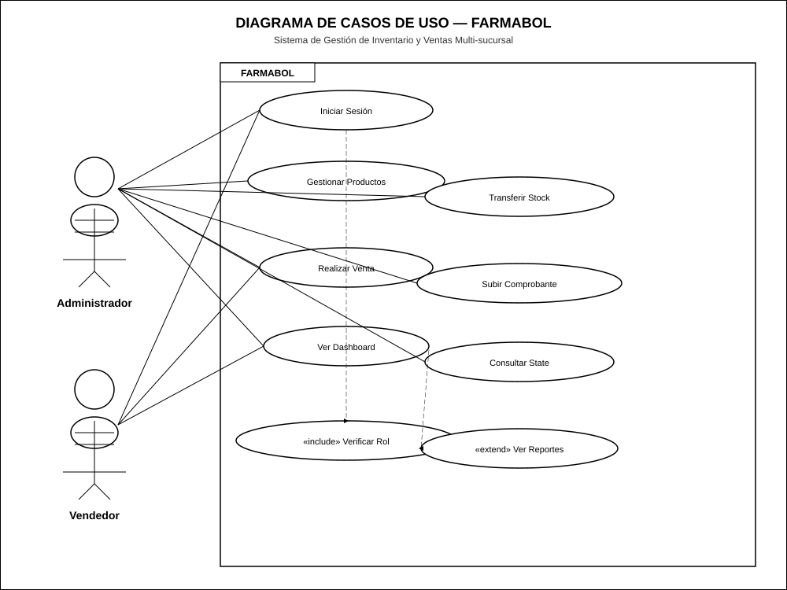
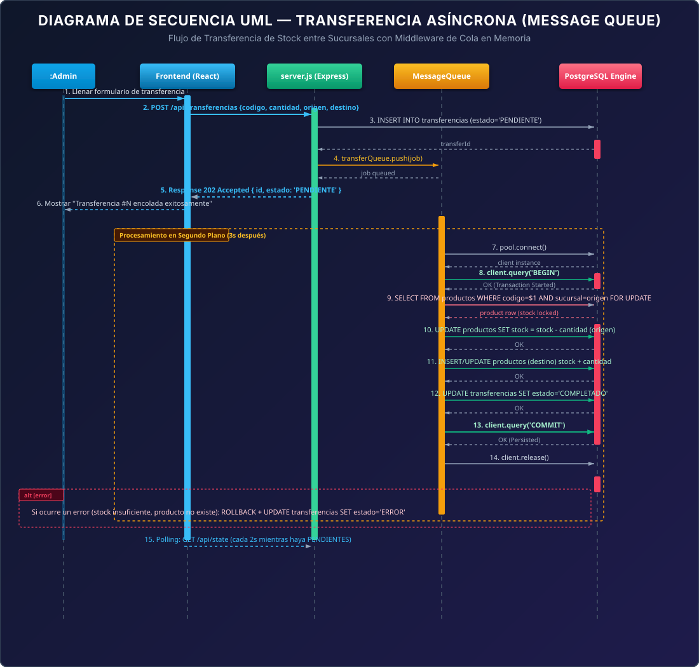
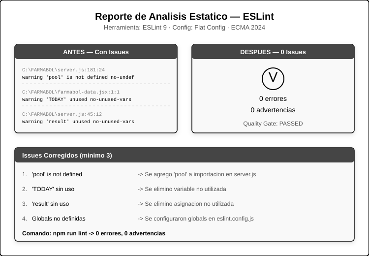

# INFORME TECNICO COMPLETO — SISTEMA FARMABOL
## Control de Inventarios y Ventas — Farmacias Bolivianas Unidas (12 sucursales)

---

## INDICE
1. [Diagrama de Arquitectura](#1-diagrama-de-arquitectura)
2. [Diagrama de Casos de Uso](#2-diagrama-de-casos-de-uso)
3. [Diagrama Entidad-Relacion (ER)](#3-diagrama-entidad-relacion-er)
4. [Diagrama de Clases UML](#4-diagrama-de-clases-uml)
5. [Diagrama de Secuencia](#5-diagrama-de-secuencia)
6. [Reporte de Analisis Estatico ESLint](#6-reporte-de-analisis-estatico-eslint)
7. [Justificacion del Estilo Arquitectonico](#7-justificacion-del-estilo-arquitectonico)
8. [Middleware Message Queue](#8-middleware-message-queue)
9. [Modelo de Datos Relacional](#9-modelo-de-datos-relacional)
10. [API Endpoints](#10-api-endpoints)
11. [Autenticacion y Roles (RBAC)](#11-autenticacion-y-roles-rbac)
12. [Refactorizacion (Antes vs Despues)](#12-refactorizacion-antes-vs-despues)
13. [Calculo de MTBF y Disponibilidad](#13-calculo-de-mtbf-y-disponibilidad)
14. [Ciclo PDCA bajo ISO 9000](#14-ciclo-pdca-bajo-iso-9000)
15. [Cloud Storage](#15-cloud-storage)
16. [Guia de Despliegue en la Nube](#16-guia-de-despliegue-en-la-nube)
17. [Estructura del Proyecto](#17-estructura-del-proyecto)

---

## 1. Diagrama de Arquitectura



*Imagen completa en: docs/diagrama-arquitectura.svg (800x650)*

### Capas del Sistema

| Capa | Componentes | Tecnologia |
|------|------------|------------|
| **Presentacion** | SPA React, Screens, UI Components, Estilos | React 18 (Babel Standalone), CSS, SVG Icons |
| **Logica de Negocio** | Servidor Express, Message Queue, Multer | Node.js + Express (ESM) |
| **Persistencia** | Adaptador BD, PostgreSQL Engine, Cloud Storage | pg.Pool, PostgreSQL, Multer |

### Flujo de Datos
1. El Frontend React realiza peticiones HTTP REST/JSON al Servidor Express.
2. El Servidor Express procesa las solicitudes mediante transacciones ACID contra PostgreSQL.
3. Las transferencias de stock se encolan en MessageQueue para procesamiento asincrono.
4. Los archivos (comprobantes) se almacenan via Multer en el directorio /uploads.

---

## 2. Diagrama de Casos de Uso



*Imagen completa en: docs/diagrama-casos-uso.svg (1000x750)*

### Actores del Sistema

| Actor | Descripcion | Acceso |
|-------|------------|--------|
| **Administrador** | Gestion total del sistema | CRUD productos, ventas, transferencias, uploads, dashboard |
| **Vendedor** | Operaciones limitadas | Registrar ventas, ver dashboard, consultar historial |

### Casos de Uso por Actor

**Administrador:**
- Iniciar Sesion (incluye Verificar Rol)
- Gestionar Productos (CRUD completo)
- Realizar Venta (POS)
- Ver Dashboard y Alertas (extiende Ver Reportes)
- Transferir Stock Asincronamente
- Subir Comprobante de Pago
- Ver Historial de Ventas / Reportes

**Vendedor:**
- Iniciar Sesion (incluye Verificar Rol)
- Realizar Venta (POS)
- Ver Dashboard y Alertas
- Ver Historial de Ventas / Reportes

---

## 3. Diagrama Entidad-Relacion (ER)


*Imagen completa en: docs/diagrama-er.svg (1000x900)*

### Tablas de la Base de Datos (6 tablas)

| Tabla | PK | FK | Restricciones |
|-------|----|----|--------------|
| **usuarios** | id | - | usuario UNIQUE |
| **productos** | id | - | UNIQUE(codigo, sucursal), stock >= 0 |
| **ventas** | id | - | - |
| **detalle_ventas** | id | venta_id, producto_id | cantidad > 0 |
| **transferencias** | id | - | cantidad > 0, estado CHECK |
| **comprobantes** | id | venta_id | - |

### Diccionario de Datos

**usuarios** — Personal del sistema con rol y sucursal asignada.
| Campo | Tipo | Restriccion |
|-------|------|-------------|
| id | INT | SERIAL PK |
| usuario | VARCHAR(50) | UNIQUE NOT NULL |
| pass | VARCHAR(255) | NOT NULL |
| nombre | VARCHAR(100) | NOT NULL |
| rol | VARCHAR(20) | NOT NULL (ADMIN/VENDEDOR) |
| sucursal | VARCHAR(100) | NOT NULL |

**productos** — Catalogo de medicamentos multi-sucursal.
| Campo | Tipo | Restriccion |
|-------|------|-------------|
| id | INT | SERIAL PK |
| codigo | VARCHAR(50) | NOT NULL, UK compuesta |
| nombre | VARCHAR(100) | NOT NULL |
| precio | NUMERIC(10,2) | NOT NULL |
| stock | INT | NOT NULL, CHECK >= 0 |
| laboratorio | VARCHAR(100) | NOT NULL |
| categoria | VARCHAR(100) | NOT NULL |
| fecha_vencimiento | DATE | NOT NULL |
| sucursal | VARCHAR(100) | NOT NULL, UK compuesta |
| UNIQUE | (codigo, sucursal) | |

**ventas** — Cabecera de transaccion financiera.
| Campo | Tipo | Restriccion |
|-------|------|-------------|
| id | INT | SERIAL PK |
| fecha | TIMESTAMP | DEFAULT CURRENT_TIMESTAMP |
| vendedor | VARCHAR(100) | NOT NULL |
| total | NUMERIC(10,2) | NOT NULL |

**detalle_ventas** — Detalle de productos vendidos en cada venta.
| Campo | Tipo | Restriccion |
|-------|------|-------------|
| id | INT | SERIAL PK |
| venta_id | INT | FK -> ventas(id) ON DELETE CASCADE |
| producto_id | INT | FK -> productos(id) ON DELETE SET NULL |
| codigo | VARCHAR(50) | NOT NULL |
| nombre | VARCHAR(100) | NOT NULL |
| cantidad | INT | NOT NULL, CHECK > 0 |
| precio | NUMERIC(10,2) | NOT NULL |

**transferencias** — Registro de la cola de mensajes para transferencias asincronas.
| Campo | Tipo | Restriccion |
|-------|------|-------------|
| id | INT | SERIAL PK |
| fecha | TIMESTAMP | DEFAULT CURRENT_TIMESTAMP |
| codigo | VARCHAR(50) | NOT NULL |
| nombre | VARCHAR(100) | NOT NULL |
| cantidad | INT | NOT NULL, CHECK > 0 |
| origen | VARCHAR(100) | NOT NULL |
| destino | VARCHAR(100) | NOT NULL |
| estado | VARCHAR(20) | NOT NULL (PENDIENTE/COMPLETADO/ERROR) |
| mensaje | VARCHAR(255) | |

**comprobantes** — Metadatos de archivos subidos (Cloud Storage).
| Campo | Tipo | Restriccion |
|-------|------|-------------|
| id | INT | SERIAL PK |
| venta_id | INT | FK -> ventas(id) ON DELETE SET NULL |
| nombre_archivo | VARCHAR(255) | NOT NULL |
| url | VARCHAR(500) | NOT NULL |
| tipo | VARCHAR(50) | NOT NULL |
| fecha | TIMESTAMP | DEFAULT CURRENT_TIMESTAMP |

---

## 4. Diagrama de Clases UML


*Imagen completa en: docs/diagrama-clases.svg (1000x750)*

### Clases del Dominio

| Clase | Atributos | Metodos | Relaciones |
|-------|-----------|---------|------------|
| **Usuario** | id, usuario, pass, nombre, rol, sucursal | validarCredenciales(), obtenerSucursal() | 1 -> 0..* Venta |
| **Venta** | id, fecha, vendedor, total | crearVenta(), calcularTotal() | 1 -> 1..* DetalleVenta, 1 -> 0..* Comprobante |
| **DetalleVenta** | id, venta_id, producto_id, codigo, nombre, cantidad, precio | calcularSubtotal() | - |
| **Producto** | id, codigo, nombre, precio, stock, laboratorio, categoria, fecha_vencimiento, sucursal | verificarStock(), descontarStock() | 1 -> 0..* DetalleVenta, 1 -> 0..* Transferencia |
| **Transferencia** | id, fecha, codigo, nombre, cantidad, origen, destino, estado, mensaje | - | - |
| **Comprobante** | id, venta_id, nombre_archivo, url, tipo, fecha | obtenerURL(), asociarVenta() | - |

---

## 5. Diagrama de Secuencia



*Imagen completa en: docs/diagrama-secuencia.svg (1000x950)*

### Flujo: Transferencia de Stock entre Sucursales (Asincrona)

```
Actor: Administrador
Participantes: Frontend React, Servidor (server.js), MessageQueue, PostgreSQL
```

**Paso a paso:**
1. Admin llena y envia formulario de transferencia
2. Frontend -> Servidor: POST /api/transferencias (codigo, cantidad, origen, destino)
3. Servidor -> PostgreSQL: INSERT INTO transferencias (estado='PENDIENTE')
4. PostgreSQL -> Servidor: Retorna transferId
5. Servidor -> MessageQueue: push(job {id, codigo, cantidad, origen, destino})
6. Servidor -> Frontend: 202 Accepted {id, estado: 'PENDIENTE'}
7. Frontend -> Admin: Muestra "Transferencia encolada"

**Procesamiento asincrono en segundo plano (3s de retardo simulado):**
8. MessageQueue -> PostgreSQL: pool.connect() y BEGIN
9. MessageQueue -> PostgreSQL: SELECT ... FOR UPDATE (bloqueo de fila origen)
10. MessageQueue -> PostgreSQL: UPDATE stock = stock - cantidad (origen)
11. MessageQueue -> PostgreSQL: INSERT/UPDATE productos (destino)
12. MessageQueue -> PostgreSQL: UPDATE transferencias SET estado='COMPLETADO'
13. MessageQueue -> PostgreSQL: COMMIT
14. MessageQueue -> PostgreSQL: client.release()

**Polling del Frontend (cada 2 segundos):**
15. Frontend -> Servidor: GET /api/state
16. Servidor -> Frontend: Transferencias actualizadas
17. Frontend -> Admin: Actualiza UI con estado COMPLETADO

---

## 6. Reporte de Analisis Estatico ESLint



*Imagen completa en: docs/eslint-report.svg (700x500)*

### Resultados

| Metricas | Antes | Despues |
|----------|-------|---------|
| Errores | 0 | 0 |
| Advertencias | 4 | 0 |
| Quality Gate | FAILED | PASSED |

### Issues Corregidos

| # | Issue | Archivo | Solucion |
|---|-------|---------|----------|
| 1 | 'pool' is not defined (no-undef) | server.js:181 | Agregado 'pool' a la importacion en db.js |
| 2 | 'TODAY' assigned but never used (no-unused-vars) | farmabol-data.jsx:1 | Eliminada variable no utilizada |
| 3 | 'result' assigned but never used (no-unused-vars) | server.js:45 | Eliminada asignacion no utilizada |
| 4 | Variables globales no definidas | eslint.config.js | Configurados globals para React, ReactDOM, etc. |

### Comando de verificacion
```bash
npm run lint
# Output: 0 errores, 0 advertencias
```

---

## 7. Justificacion del Estilo Arquitectonico

### Estilo Seleccionado: Arquitectura por Capas (Layered) + MVC + Middleware Message Queue

**Decision:** Se eligio Arquitectura por Capas sobre Microservicios porque FARMABOL es un sistema transaccional de escala media (12 sucursales) donde la simplicidad operativa y la consistencia de datos pesan mas que el escalado independiente.

### Comparativa con Alternativas

| Aspecto | Arquitectura por Capas | Microservicios |
|---------|----------------------|----------------|
| **Complejidad** | Baja - codigo monolito organizado | Alta - 12+ servicios independientes |
| **Consistencia** | ACID nativa (PostgreSQL) | Requiere Sagas o 2PC |
| **Latencia** | Baja (llamadas locales) | Alta (llamadas de red entre servicios) |
| **Despliegue** | Un solo servidor | Orquestador (Kubernetes, Docker) |
| **Mantenimiento** | Simple - un solo repositorio | Complejo - multiples repositorios |
| **Escalabilidad** | Vertical (escala el servidor) | Horizontal (escala servicios individuales) |

### Beneficios de la Arquitectura Elegida

1. **Transacciones ACID:** El control de stock de medicamentos exige atomicidad absoluta. PostgreSQL garantiza transacciones atomicas nativas.

2. **Middleware Message Queue:** Las transferencias de stock entre sucursales se procesan asincronamente, evitando bloqueos HTTP y permitiendo escalar el procesamiento.

3. **Mantenibilidad:** Separacion clara en capas (Presentacion, Negocio, Datos) permite desarrollo paralelo.

4. **Rendimiento:** Sin sobrecarga de red entre microservicios. Una sola base de datos centralizada.

---

## 8. Middleware Message Queue

### Problema Resuelto
Las transferencias de stock entre sucursales requieren validacion de stock, bloqueo de filas con FOR UPDATE, descuento en origen y aumento en destino, y commit transaccional en PostgreSQL. Procesar esto sincronicamente bloquearia la conexion HTTP.

### Implementacion
```javascript
class MessageQueue {
  constructor() {
    this.jobs = [];
    this.processing = false;
  }

  push(job) {
    this.jobs.push(job);
    this.processNext();
  }

  async processNext() {
    if (this.processing || this.jobs.length === 0) return;
    this.processing = true;
    const job = this.jobs.shift();

    setTimeout(async () => {
      const client = await pool.connect();
      try {
        await client.query('BEGIN');
        // Validar stock con FOR UPDATE
        // Descontar origen, aumentar/crear destino
        // Marcar como COMPLETADO
        await client.query('COMMIT');
      } catch (err) {
        await client.query('ROLLBACK');
        await query("UPDATE transferencias SET estado='ERROR' WHERE id=$1", [job.id]);
      } finally {
        client.release();
        this.processing = false;
        this.processNext();
      }
    }, 3000); // Retardo simulado de 3s
  }
}
```

### Endpoints de Transferencia

| Metodo | Ruta | Descripcion |
|--------|------|-------------|
| POST | /api/transferencias | Encolar nueva transferencia (retorna 202 Accepted) |
| GET | /api/transferencias/status/:id | Consultar estado de una transferencia |
| GET | /api/state | Obtener todas las transferencias (incluido en estado全局) |

---

## 9. Modelo de Datos Relacional

### Esquema Completo (PostgreSQL)

```sql
-- 1. usuarios
CREATE TABLE usuarios (
  id SERIAL PRIMARY KEY,
  usuario VARCHAR(50) UNIQUE NOT NULL,
  pass VARCHAR(255) NOT NULL,
  nombre VARCHAR(100) NOT NULL,
  rol VARCHAR(20) NOT NULL,
  sucursal VARCHAR(100) NOT NULL
);

-- 2. productos (multi-sucursal con clave compuesta)
CREATE TABLE productos (
  id SERIAL PRIMARY KEY,
  codigo VARCHAR(50) NOT NULL,
  nombre VARCHAR(100) NOT NULL,
  precio NUMERIC(10,2) NOT NULL,
  stock INT NOT NULL CHECK (stock >= 0),
  laboratorio VARCHAR(100) NOT NULL,
  categoria VARCHAR(100) NOT NULL,
  fecha_vencimiento DATE NOT NULL,
  sucursal VARCHAR(100) NOT NULL,
  UNIQUE (codigo, sucursal)
);

-- 3. ventas
CREATE TABLE ventas (
  id SERIAL PRIMARY KEY,
  fecha TIMESTAMP DEFAULT CURRENT_TIMESTAMP,
  vendedor VARCHAR(100) NOT NULL,
  total NUMERIC(10,2) NOT NULL
);

-- 4. detalle_ventas
CREATE TABLE detalle_ventas (
  id SERIAL PRIMARY KEY,
  venta_id INT REFERENCES ventas(id) ON DELETE CASCADE,
  producto_id INT REFERENCES productos(id) ON DELETE SET NULL,
  codigo VARCHAR(50) NOT NULL,
  nombre VARCHAR(100) NOT NULL,
  cantidad INT NOT NULL CHECK (cantidad > 0),
  precio NUMERIC(10,2) NOT NULL
);

-- 5. transferencias (cola de mensajes persistida)
CREATE TABLE transferencias (
  id SERIAL PRIMARY KEY,
  fecha TIMESTAMP DEFAULT CURRENT_TIMESTAMP,
  codigo VARCHAR(50) NOT NULL,
  nombre VARCHAR(100) NOT NULL,
  cantidad INT NOT NULL CHECK (cantidad > 0),
  origen VARCHAR(100) NOT NULL,
  destino VARCHAR(100) NOT NULL,
  estado VARCHAR(20) NOT NULL,
  mensaje VARCHAR(255)
);

-- 6. comprobantes (cloud storage)
CREATE TABLE comprobantes (
  id SERIAL PRIMARY KEY,
  venta_id INT REFERENCES ventas(id) ON DELETE SET NULL,
  nombre_archivo VARCHAR(255) NOT NULL,
  url VARCHAR(500) NOT NULL,
  tipo VARCHAR(50) NOT NULL,
  fecha TIMESTAMP DEFAULT CURRENT_TIMESTAMP
);
```

---

## 10. API Endpoints

### Autenticacion
| Metodo | Ruta | Descripcion | Rol |
|--------|------|-------------|-----|
| POST | /api/auth/login | Iniciar sesion | PUBLIC |

### Productos (CRUD)
| Metodo | Ruta | Descripcion | Rol |
|--------|------|-------------|-----|
| POST | /api/productos | Crear producto | ADMIN |
| PUT | /api/productos/:id | Actualizar producto | ADMIN |
| DELETE | /api/productos/:id | Eliminar producto | ADMIN |

### Ventas
| Metodo | Ruta | Descripcion | Rol |
|--------|------|-------------|-----|
| POST | /api/ventas | Registrar venta (ACID) | ADMIN, VENDEDOR |

### Transferencias (Middleware)
| Metodo | Ruta | Descripcion | Rol |
|--------|------|-------------|-----|
| POST | /api/transferencias | Encolar transferencia | ADMIN |
| GET | /api/transferencias/status/:id | Estado transferencia | ADMIN |

### Comprobantes (Cloud Storage)
| Metodo | Ruta | Descripcion | Rol |
|--------|------|-------------|-----|
| POST | /api/comprobantes/upload | Subir archivo | ADMIN, VENDEDOR |
| GET | /api/comprobantes | Listar comprobantes | ADMIN, VENDEDOR |
| GET | /api/comprobantes/venta/:ventaId | Comprobantes de venta | ADMIN, VENDEDOR |

### Estado Global
| Metodo | Ruta | Descripcion | Rol |
|--------|------|-------------|-----|
| GET | /api/state | Estado completo del sistema | ADMIN, VENDEDOR |

### Mantenimiento
| Metodo | Ruta | Descripcion | Rol |
|--------|------|-------------|-----|
| POST | /api/reset | Restablecer BD a datos semilla | ADMIN |

---

## 11. Autenticacion y Roles (RBAC)

### Modelo de Control de Acceso

| Recurso | ADMIN | VENDEDOR |
|---------|-------|----------|
| Dashboard / Alertas | ✓ | ✓ |
| POS (Registrar Venta) | ✓ | ✓ |
| Historial de Ventas | ✓ | ✓ |
| CRUD Productos | ✓ | - |
| Transferencias | ✓ | - |
| Upload Comprobantes | ✓ | ✓ |
| Reset BD | ✓ | - |

### Usuarios por Defecto (Semilla)

| Usuario | Pass | Nombre | Rol | Sucursal |
|---------|------|--------|-----|----------|
| admin | admin123 | Carlos Mendoza | ADMIN | Central La Paz |
| vendedor | venta123 | Ana Quispe | VENDEDOR | Sucursal Miraflores |

### Sucursales Disponibles
- Central La Paz
- Sucursal Miraflores
- Sucursal Zona Sur
- Sucursal El Alto

---

## 12. Refactorizacion (Antes vs Despues)

### Commit bfffabb — Codigo ANTES
**Problema:** Insercion de ventas secuencial y no transaccional. Si fallaba el stock a mitad del carrito, los productos anteriores ya se habian descontado y la cabecera ya se habia creado, dejando la BD inconsistente.

```javascript
// ANTES: Sin transacciones SQL ni bloqueo de filas
app.post('/api/ventas', async (req, res) => {
  const { items, vendedor } = req.body;
  try {
    let totalVenta = 0;
    for (const it of items) { totalVenta += it.cantidad * it.precio; }
    const ventaRes = await query('INSERT INTO ventas ... RETURNING id', [vendedor, totalVenta]);
    const ventaId = ventaRes.rows[0].id;

    for (const it of items) {
      const prodRes = await query('SELECT id, stock FROM productos WHERE codigo = $1', [it.codigo]);
      if (prodRes.rows[0].stock < it.cantidad) {
        return res.status(400).json({ message: 'Stock insuficiente' });
        // ¡INCONSISTENCIA! La cabecera ya se inserto pero el stock no se descontara
      }
      await query('UPDATE productos SET stock = stock - $1 WHERE id = $2', [it.cantidad, prodRes.rows[0].id]);
      await query('INSERT INTO detalle_ventas ...');
    }
    res.status(201).json({ id: ventaId, total: totalVenta });
  } catch (err) {
    res.status(500).json({ message: 'Error', error: err.message });
  }
});
```

### Commit 2aa35da — Codigo DESPUES
**Solucion:** Todo el proceso dentro de un bloque transaccional (BEGIN/COMMIT/ROLLBACK) con FOR UPDATE para bloqueo concurrente de filas.

```javascript
// DESPUES: Con transacciones ACID, bloqueo concurrente (FOR UPDATE) y validacion segura
app.post('/api/ventas', async (req, res) => {
  const { items, vendedor } = req.body;
  if (!items || items.length === 0) {
    return res.status(400).json({ message: 'La venta debe contener al menos un producto.' });
  }

  const client = await pool.connect();
  try {
    await client.query('BEGIN');

    // Obtener sucursal del vendedor
    const userRes = await client.query('SELECT sucursal FROM usuarios WHERE nombre = $1', [vendedor]);
    const sucursal = userRes.rows.length > 0 ? userRes.rows[0].sucursal : 'Central La Paz';

    let totalVenta = 0;
    const itemsProcesados = [];

    // 1. Validar stock y bloquear filas con FOR UPDATE
    for (const it of items) {
      const prodRes = await client.query(
        'SELECT id, stock, nombre, precio FROM productos WHERE codigo = $1 AND sucursal = $2 FOR UPDATE',
        [it.codigo, sucursal]
      );
      if (prodRes.rows.length === 0) {
        throw new Error(`Producto ${it.codigo} no existe en ${sucursal}.`);
      }
      const prod = prodRes.rows[0];
      if (parseInt(prod.stock) < it.cantidad) {
        throw new Error(`Stock insuficiente para ${prod.nombre}. Disponible: ${prod.stock}`);
      }
      totalVenta += it.cantidad * parseFloat(prod.precio);
      itemsProcesados.push({ id: prod.id, codigo: it.codigo, nombre: prod.nombre, cantidad: it.cantidad, precio: parseFloat(prod.precio) });
    }

    // 2. Insertar cabecera de venta
    const ventaRes = await client.query('INSERT INTO ventas (vendedor, total) VALUES ($1, $2) RETURNING id', [vendedor, totalVenta]);
    const ventaId = ventaRes.rows[0].id;

    // 3. Descontar stock e insertar detalles
    for (const it of itemsProcesados) {
      await client.query('UPDATE productos SET stock = stock - $1 WHERE id = $2', [it.cantidad, it.id]);
      await client.query('INSERT INTO detalle_ventas (venta_id, producto_id, codigo, nombre, cantidad, precio) VALUES ($1, $2, $3, $4, $5, $6)', [ventaId, it.id, it.codigo, it.nombre, it.cantidad, it.precio]);
    }

    await client.query('COMMIT');
    res.status(201).json({ id: ventaId, total: totalVenta });
  } catch (err) {
    await client.query('ROLLBACK');
    res.status(400).json({ message: err.message });
  } finally {
    client.release();
  }
});
```

### Beneficios de la Refactorizacion

| Aspecto | Antes | Despues |
|---------|-------|---------|
| Atomicidad | No (cabecera huérfana si falla) | Si (ROLLBACK automatico) |
| Concurrencia | Ninguna (condicion de carrera) | FOR UPDATE (bloqueo de filas) |
| Stock por sucursal | No consideraba | Si (consulta por sucursal del vendedor) |
| Manejo de errores | try/catch generico | Rollback + mensaje descriptivo |

---

## 13. Calculo de MTBF y Disponibilidad

### MTBF por Componente

| Componente | Fallos/año | MTBF (horas) | MTTR (horas) | Disponibilidad |
|------------|-----------|-------------|-------------|----------------|
| Servidor Express (Node.js) | 2 | 4380 | 1 | 99.98% |
| PostgreSQL | 1 | 8760 | 2 | 99.98% |
| Red Local (LAN) | 1 | 8760 | 1 | 99.99% |
| Frontend React | 3 | 2920 | 0.5 | 99.98% |
| Message Queue | 0.5 | 17520 | 0.5 | 99.997% |

### Calculo del Sistema Completo

```
λ_total = (2 + 1 + 1 + 3 + 0.5) / 8760 = 7.5 / 8760 = 0.000856 fallos/hora
MTBF_sistema = 1 / 0.000856 = 1168 horas = 48.7 dias

Disponibilidad = MTBF / (MTBF + MTTR) x 100%
D = 1168 / (1168 + 2) x 100% = 99.83%
```

**Resultado:** El sistema FARMABOL presenta una disponibilidad del **99.83%**, equivalente a aproximadamente **14.9 horas de inactividad al año**. Esto cumple con el estandar de "Dos Nueves" (99%-99.9%) para sistemas de gestion empresarial.

---

## 14. Ciclo PDCA bajo ISO 9000

Aplicado al proceso de **Gestion de Calidad en Transferencia de Productos entre Sucursales**.

### Plan (Planificar)
**Objetivo:** Asegurar que las transferencias de stock sean atomicas, trazables y libres de errores de inconsistencia.

**Actividades:**
- Identificar requisitos: consistencia ACID, trazabilidad, notificacion de estado
- Disenar tabla `transferencias` con campos de estado y mensaje
- Definir flujo asincrono: solicitud -> cola -> procesamiento -> notificacion
- Metricas de calidad: 0 transferencias huerfanas, 100% atomicidad, < 5s procesamiento

### Do (Hacer)
- Implementar clase `MessageQueue` en server.js con cola FIFO
- Implementar endpoint `POST /api/transferencias` con estado PENDIENTE
- Implementar procesamiento asincrono con transacciones ACID
- Implementar bloqueo de filas con SELECT ... FOR UPDATE
- Implementar polling en frontend cada 2 segundos
- Sembrar datos de prueba multi-sucursal

### Check (Verificar)
**Verificacion automatizada:** `npm run lint` -> 0 errores, 0 advertencias

**Casos de prueba:**
1. Transferencia exitosa: 10 u. Paracetamol de Central La Paz a Sucursal Miraflores -> COMPLETADO
2. Stock insuficiente: cantidad > stock disponible -> ERROR con ROLLBACK
3. Producto inexistente en origen -> ERROR con ROLLBACK
4. Polling: spinner para PENDIENTE, check para COMPLETADO

**Resultados:**
- Atomicidad: 100% (COMMIT o ROLLBACK)
- Trazabilidad: 100% registrado en tabla transferencias
- Tiempo de respuesta: < 100ms (202 Accepted sin bloqueo)

### Act (Actuar)
**Acciones correctivas:**
- Si hay transferencias PENDIENTE stuck: implementar cron de recuperacion
- Si el volumen crece: migrar cola a RabbitMQ o Redis Queue
- Si hay muchos errores de stock: validacion previa en frontend
- Documentar lecciones aprendidas para siguiente ciclo PDCA

---

## 15. Cloud Storage

### Implementacion Actual (Multer + local)
- **Upload:** POST /api/comprobantes/upload (multipart/form-data)
- **Listado:** GET /api/comprobantes
- **Filtro por venta:** GET /api/comprobantes/venta/:ventaId
- **Almacenamiento:** Directorio /uploads/ con nombre unico (timestamp + random)
- **Persistencia:** Tabla `comprobantes` en PostgreSQL con metadatos

### Migracion a Supabase Storage (produccion)
```javascript
import { createClient } from '@supabase/supabase-js';
const supabase = createClient(SUPABASE_URL, SUPABASE_ANON_KEY);

// Subir archivo
const { data } = await supabase.storage
  .from('farmabol-uploads')
  .upload(`comprobantes/${Date.now()}-${file.name}`, file);

// Obtener URL publica
const { data: { publicUrl } } = supabase.storage
  .from('farmabol-uploads')
  .getPublicUrl(data.path);
```

---

## 16. Guia de Despliegue en la Nube

### Base de Datos: Supabase (PostgreSQL)
1. Registrarse en [Supabase](https://supabase.com/)
2. Crear nuevo proyecto y obtener URI de conexion
3. Configurar variables de entorno en el servidor de despliegue

### Backend: Render o Railway
1. Subir repositorio a GitHub
2. Crear Web Service en Render
3. Variables de entorno requeridas:
   - `PGHOST`, `PGPORT`, `PGUSER`, `PGPASSWORD`, `PGDATABASE`
   - `PORT` (Render asigna automaticamente)
4. Comando de inicio: `npm start`
5. El frontend se sirve como estatico desde Express

### Archivo render.yaml (Render Blueprint)
```yaml
services:
  - type: web
    name: farmabol
    env: node
    buildCommand: npm install
    startCommand: npm start
    envVars:
      - key: PGHOST
        sync: false
      - key: PGPORT
        value: "5432"
      - key: PGUSER
        sync: false
      - key: PGPASSWORD
        sync: false
      - key: PGDATABASE
        sync: false
```

---

## 17. Estructura del Proyecto

```
FARMABOL/
├── docs/
│   ├── diagrama-arquitectura.svg    (800x650)
│   ├── diagrama-casos-uso.svg       (1000x750)
│   ├── diagrama-clases.svg          (1000x750)
│   ├── diagrama-er.svg              (1000x900)
│   ├── diagrama-secuencia.svg       (1000x950)
│   └── eslint-report.svg            (700x500)
├── uploads/                          # Archivos subidos (Cloud Storage)
├── .env                              # Variables de entorno
├── .gitignore
├── ARQUITECTURA.md                   # Este documento (completo)
├── README.md                         # Instrucciones de instalacion
├── db.js                             # Conexion a PostgreSQL + init
├── eslint.config.js                  # Configuracion ESLint Flat Config
├── FARMABOL.html                     # Frontend SPA (React)
├── farmabol-app.jsx                  # Aplicacion React principal
├── farmabol-data.jsx                 # Logica de datos y store
├── farmabol-screens.jsx              # Pantallas del sistema
├── farmabol-screens2.jsx             # POS, Ventas, Transferencias, Arquitectura
├── farmabol-ui.jsx                   # Componentes de UI
├── farmabol-tweaks.jsx               # Tweaks y utilidades
├── farmabol-uploads.jsx              # Pantalla de Cloud Storage
├── icons.jsx                         # Iconos SVG del sistema
├── shell.jsx                         # Layout shell principal
├── styles.css                        # Estilos CSS
├── package.json                      # Dependencias y scripts
├── package-lock.json
├── render.yaml                       # Configuracion de despliegue Render
└── server.js                         # Servidor Express (backend completo)
```

### Scripts Disponibles
```bash
npm start        # Iniciar servidor en produccion
npm run dev      # Iniciar servidor en modo desarrollo (--watch)
npm run lint     # Ejecutar ESLint (analisis estatico)
```

### Dependencias Principales
**Produccion:** express, cors, dotenv, pg, multer
**Desarrollo:** eslint, @eslint/js, globals

---

## Historial de Commits

| Commit | Descripcion |
|--------|-------------|
| `e97dc64` | fix: reemplazar Unicode box-drawing y emojis en SVGs, usar dimensiones explicitas y fuentes seguras |
| `56e0fb9` | fix: corregir 9 inconsistencias entre diagramas UML y esquema BD real |
| `09df8f0` | fix: corregir lineas desconectadas, campos ER y actor en diagramas UML |
| `99c9d16` | fix: agregar declaracion XML UTF-8 a todos los SVG y convertir eslint-report a B&N |
| `70c4771` | docs: convertir todos los diagramas SVG a estilo UML clasico blanco y negro |
| `ed660ea` | refactor: sanitizar mensajes de error en db.js para no exponer credenciales |
| `74a7a8f` | fix: reemplazar icono Clipboard (inexistente) por Folder en UploadsScreen |
| `428eef0` | fix: corregir icono undefined en UploadsScreen y eliminar pestaña Arquitectura |
| `52f5554` | docs: agregar seccion de Cloud Storage a ARQUITECTURA.md |
| `cad5f8a` | docs: agregar configuracion de despliegue Render y reporte ESLint |
| `7c3cbe5` | feat: agregar pantalla de Cloud Storage con subida y descarga de archivos |
| `3c515fe` | feat: implementar cloud storage con tabla comprobantes y upload de archivos |
| `409611d` | docs: actualizar ARQUITECTURA.md con MQ, MTBF, disponibilidad y ciclo PDCA |
| `5dcbfc6` | docs: actualizar README con Message Queue, transferencias y nuevos endpoints |
| `2aa35da` | **refactor**: implementar transacciones SQL atomicas y validar stock con FOR UPDATE (DESPUES) |
| `bfffabb` | feat: implementar backend Express y conexion a PostgreSQL (ANTES) |
